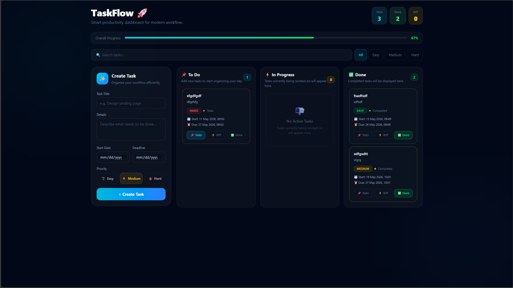
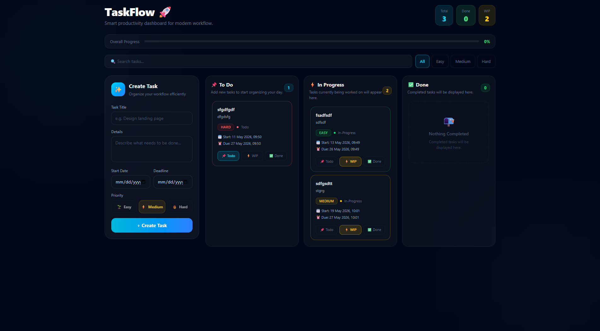

<div align="center">

# 🚀 TaskFlow

**A modern Kanban-style task management dashboard built with React.**  
Drag, drop, filter, and track your workflow — all in one beautiful dark UI.

</div>

---

## ✨ Features

- **Kanban Board** — Three columns: _To Do_, _In Progress_, and _Done_
- **Drag & Drop** — Move tasks between columns using `@hello-pangea/dnd`
- **Task Creation** — Title, details, start date, deadline, and priority level
- **Priority Levels** — Easy 🌱 / Medium ⚡ / Hard 🔥 with color-coded cards
- **Live Search** — Filter tasks by title or description in real time
- **Priority Filter** — Show only tasks matching a selected priority
- **Progress Bar** — Animated overall completion percentage
- **Stat Chips** — Live counters for Total, WIP, and Done tasks
- **Persistent Storage** — Tasks saved to `localStorage` with no race conditions
- **Responsive Layout** — Sidebar + board grid, collapses to single column on mobile

---

## 📸 Preview

> _Dark theme with glowing cyan/blue accents, animated drag feedback, and smooth transitions._

```
┌─────────────────────────────────────────────────────────────────┐
│  TaskFlow 🚀               [ Total: 5 ]  [ Done: 2 ]  [ WIP: 1 ]│
│  ─────────────────────────────────────────────────────────────  │
│  Overall Progress ████████████░░░░░░░░  60%                     │
│  🔍 Search...   [ all ] [ easy ] [ medium ] [ hard ]            │
│  ┌─────────────┐  ┌───────────────────────────────────────────┐ │
│  │ ✨ Create   │  │ 📌 To Do   ⚡ In Progress   ✅ Done      │ │
│  │   Task      │  │  ┌───────┐  ┌───────────┐  ┌──────────┐  │ │
│  │             │  │  │ Card  │  │   Card    │  │  Card    │  │ │
│  │  [ inputs ] │  │  └───────┘  └───────────┘  └──────────┘  │ │
│  └─────────────┘  └───────────────────────────────────────────┘ │
└─────────────────────────────────────────────────────────────────┘
```

<div>
    
    
</div>

---

## 🗂 Project Structure

```
src/
├── App.jsx                  # Root — DragDropContext, state, search, filter, localStorage
└── Components/
    ├── AddTask.jsx          # Task creation form (sticky sidebar)
    ├── TaskList.jsx         # Renders the three columns, passes droppableId
    ├── TaskColumn.jsx       # Droppable zone — one column per status
    └── TaskCard.jsx         # Draggable task card with status buttons
```

---

## ⚙️ Tech Stack

| Package                                                  | Purpose                 |
| -------------------------------------------------------- | ----------------------- |
| [React 18](https://react.dev)                            | UI library              |
| [Vite](https://vitejs.dev)                               | Build tool & dev server |
| [Tailwind CSS v3](https://tailwindcss.com)               | Utility-first styling   |
| [@hello-pangea/dnd](https://github.com/hello-pangea/dnd) | Drag and drop           |

---

## 🚀 Getting Started

### Prerequisites

- Node.js `>= 18`
- npm or yarn

### Installation

```bash
# 1. Clone the repo
git clone https://github.com/Sa3dMustafa/To-Do-App--
cd taskflow

# 2. Install dependencies
npm install

# 3. Start the dev server
npm run dev
```

Open [http://localhost:5173](http://localhost:5173) in your browser.

### Build for production

```bash
npm run build
```

---

## 🤝 Contributing

1. Fork the repository
2. Create a feature branch — `git checkout -b feature/my-feature`
3. Commit your changes — `git commit -m "feat: add my feature"`
4. Push — `git push origin feature/my-feature`
5. Open a Pull Request

---

<div align="center">
  Made with ❤️ and way too much caffeine ☕
</div>
